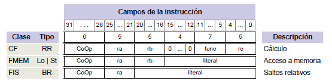
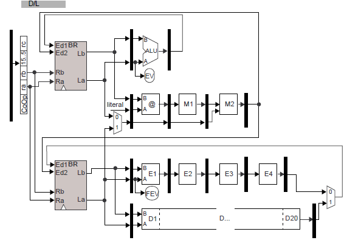
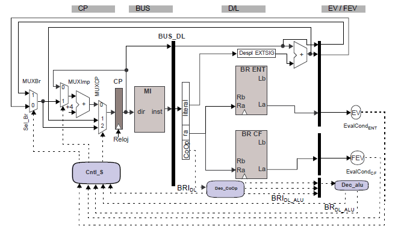
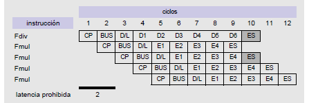
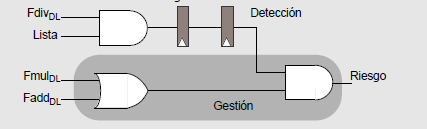
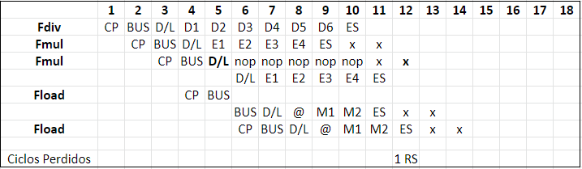

## TEMA 5 Procesador Segmentado Multiciclo

[TOC]

En este tema, se diseñan varios caminos de datos, en función del tipo de instrucción. Cada unidad de cálculo puede <u>estar segmentada o no</u> y tener una <u>latencia de cálculo diferente</u>.

### Instrucciones en coma flotante

Esta es una possible implementación de instrucciones en coma flotante:

* Se añadira un BR para datos en coma flotante, prefijo F delante del ordinal.
* Las @ de memoria seguirán necesitando acceder al banco de registros de enteros(rb).
* Las operaciones RR serán la suma, multiplicación(ambas con 4 ciclos de latencia y latencia de inicio 1) y división (20 ciclos de latencia de ejecucción y 20 de inicio).
* En general, la segmentación de las ramificaciones tendran L etapas de cálculo y una última de escritura.

### Camino de datos

Con estas instrucciones obtenemos el siguiente camino de datos, lo dividiremos en <u>ejecucción</u> y <u>subministro de instrucciones</u>.

#### Ejecucción

* Las operaciones de enteros, solamente actualizan el banco de registros de enteros.
* Las operaciones de acceso a memoria siempre se calcula la @ efectiva con el rB(ent) y pueden:
  * Store de los dos bancos de registros.
  * Load al banco de registros entero y de coma flotante.
* La operaciones de suma y multiplicación estan segmentadas y tiene latencia de 4 ciclos. Utilizan el mismo camino de actualización del BRF que la división.
* La operación de división no esta segmentada y tiene una latencia de inicio de 20 ciclos.
* Las operaciones de salto condicional se evaluan en los módulos FEV y EV, actualizan el PC en el ciclo 4 (siguiente a DL); mientras que las de salto incondicional lo hacen en la etapa D/L.

#### Suministro de instrucciones

El registro CP puede "funcionar" con los siguientes modos, donde se pueden gestionar situaciones de salto:

* CP nuevo = CP anterior + 4 -> modo implicito.
* CP nuevo = CP anterior + Despl DL-> Salto incondicional.
* CP nuevo = CP anterior + Despl DL if (FEV or EV) -> Salto condicional.

**Instrucciones en fase de ejecucción**: Esta caracteristica viene dada <u>por la ramificación segmentada de más etapas</u> y sumando el numero de ramificaciones no segmentadas con latencia de ejecucción superior a las segmentadas.

**Instrucción lista** : Una instruccion está lista para iniciar la ejecucción si no existen riesgos estructurales y de datos.

### Gestión de riesgos - Lógica de interbloqueos

Deberemos contemplar los riesgos como anteriormente; se efectuará en la etapa DL. Estos riesgos haran que una instrucción no este lista.

Los posibles riesgos que se pueden dar. Los riesgos de datos actuarán sobre el control de cortociruitos. 

* Riesgos de datos por dependencia verdadera (R(i), D(i+k)).
* Riesgos de datos por dependencia de salida (R(i), R(i+k)).
* Riesgos estructurales, por la escritura en el banco de registros.
* Riesgos de secuenciamiento (se gestionan com en el capitulo anterior).

La actuación ante un riesgo, será emular funcionamiento série. En las ramificaciones (con riesgos) se <u>inyectaran</u> nop's y se <u>bloquearan</u> las etapas prévias(CP, BUS y DL).

**Deberemos considerar que todas las instrucciones tiene la misma latencia de cálculo(cojeremos la máxima), para poder calcular los ciclos perdidos.Los ciclos perdidos serán aquellos ciclos donde finalice una operación.** 

#### Riesgos Estructurales - Deteción

Se puede tener un riesgo estructural <u>por la escritura en el banco de registros de coma flotante</u> o debido a la <u>unidad de división</u>, que no esta segmentada(latencia de inicio > 1).

* La latencia prohibida es de 2 ciclos (entre Fdiv y Fmul/Fadd), pués una instrucción de coma flotante escribiria en el mismo ciclo que la Fdiv de dos ciclos antes.
* Con la operacion de división, al no estar segmentada, la entrada debe mantenerse sin cambios todos los ciclos de cálculos. Con una latencia de ejecucción de 6 ciclos las latencia prohibidas son {1,2,3,4 y 5}.

#### Riesgos Estructurales - Actuación

Los dos riesgos de gestionan de forma diferente:

* Operaciones no segmentadas (división): 

  Se mantiene un <u>vector de bits</u>, llamado vector de ocupadas(VO). Este vector tendra una posición por cada unidad no segmentada y el bit correspondiente estará <u>activado</u> si la unidad esta siendo utilizada y esta entre el primer ciclo de ejecucción y el penúltimo. En el último ciclo de ejecucción se desactiva (antes de la etapa ES). 

  El control de riesgos, leera este vector de ocupadas y si esta activado se habrá detectado un riesgo estructural. **No habrá que inyectar una nop por la ramificación**, pues la entrada tiene los datos que se estan procesando actualmente.

* Conflictos con el banco de registros de coma flotante:

  

  Se utilizará un contador hardware. La instrucción más joven se bloquearan en la etapa DL y se inyectaran nop's por la ramificación correspondiente:

  

#### Riesgos de datos - Detección

#### Riesgos de datos - Actuación

### Cálculo del CPI