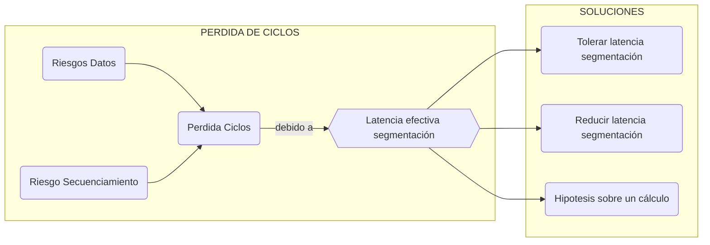

[TOC]

# Tema 4 AC2

Con la segmentación del tema 3 tenemos ciertos momento de riesgo donde perdemos ciclos, en este tema se exponen varias soluciones.



## Planificación de instrucciones - Tolerar latencia segmentación

Sobre un conjunto de instrucciones, puede existir una ordenación que no afecete en el resultado final y tolere la latencia de segmentación. Entre una instrucción productora y una consumidora se colocan otras instrucciones que no afecten el resultado y que 'den tiempo' a la productora a escribir el resultado. 

> Tres ordenaciones diferentes de las instrucciones, que dan el mismo resultado
>
> ````asm
> add r4, r1, r3 		add r4, r1, r3 		add r4, r1, r3
> sub r5, r2, r4 		sub r9, r8, r6 		sub r9, r8, r6
> sub r9, r8, r6 		sub r5, r2, r4 		cmple r12, r13, r14
> add r10, r0,r9 		add r10, r0,r9 		sub r5, r2, r4
> cmple r12, r13, r14 cmple r12, r13, r14 add r10, r0, r9
> CP = 2 + 2			CP = 1				CP = 0
> ````
>
> El diagrama resultante es:
>

El grafo de dependencias expresa un orden parcial.

#### Bloque básico estático BB

Los bloques de instrucciones a ordenar a traves de un algoritmo de planificación se llaman bloques básicos estáticos. 

* Empezará en un *líder* que se identifica:
  * En el principio del código,
  * Una instrucción destino de secuenciamiento,
  * Una instrucción de secuenciamiento, acaba en el próximo líder.
* Acabará en el próximo líder, esta ultima instrucción tendra una dependencia de control. Deberá interpretarse siempre en úlitmo lugar.

Cualquier ordenanción del grafo del BB es una planificación correcta. El objetivo es perder el menor numero de ciclos posible.

#### Algoritmo de planificación de instrucciones

* Una planificación para reducir los ciclos perdidos deben tener en cuenta el retardo/latencia productor-uso. 

* Los compiladores son los encargados de aplicar los algoritmos (medio transparente al programador).

* Un algoritmo de planificación, por lista tendrá las siguientes caracteristicas:

  1. Partir del grafo de dependencias, añadir etiqueta con  el retardo productor-uso -1.
  2. Antidependencias y dependencias de salida etiqueta 0. Arcos adicionales para la última instrucción(BR).
  3. Lista elegibles:
     1. Raices del árbol o nodo sin predecesor
     2. Tiene predecesor y t >=TMC(se calcula->TMC=t+tag)
  4. Euristica selección: Se eligira de la lista de elegibles el que cumpla
     1. Camino más largo
     2. Si hay empate, el que aparecia primero en el orden del programa

  ````c
  //PSEUDOCODIGO:
  int t = 0;
  List<ints> ret; Graph<inst> dep; List<inst> ele;
  ele = init(dep); //inicializar lista elegibles
  while(!dep.isEmpty()){
      if(ele.isEmpty()) ++t, break;
      inst n = heuristica(ele);
      del_graph_list(n);
      append(ret, n);
      ++t;
  	for_each(node s: n->succesors) 
          s.tag = max(s.tag, t+s.arco);
      for_each(node s: dep)
          if(s->tag < 0) ele.add(s);
     	ele.add(dep.roots);
  }
  return ret;
  ````

## Cortocircuitos - Reducir laténcia segmentación

Observamos que el resultado de una operación ya se conoce antes de que se escriba, entonces se puede enviar este resultado a etapas posteriores para su uso. Tomando la segmentación clásica, tenemos los siguientes cortocircuitos:

````mermaid
graph LR;
subgraph Etapas
	CP ==> BUS ==> D/L ==> ALU ==> M ==> ES
end
````

> Cortocircuito M -> DL
>
> Cortocircuito ALU -> DL

#### Características de los cortocircuitos

Un cortocircuito añade un bucle hardware, y almenos un multilpexor para poder selecionar la información.

La comunicación entre etapas puede hacerse al final de una etapa:

* Finalizando el ciclo : El tiempo de la etapa solo se suma el tiempo del multiplexor.
* Al inicio del ciclo: El tiempo total es la suma de los dos tiempos de lógica.

## Reducción de la penalización del secuenciamiento

### Predicción fija del sentido

