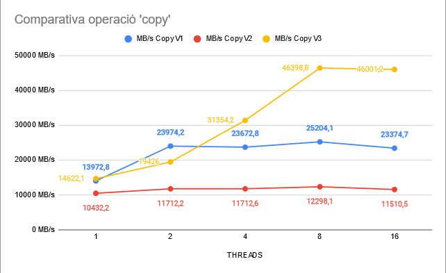

## LAB 3: Performance characteritzation of HPC clusters

En el document s'inclouen els resultats de diferents programes de prova. Els resultats es comparen amb la màquina BOADA. Cada programa de proves està dissenyat per un supòsit.

### Stream

Aquest joc de proves comprova operacions d’alt ús de memória. L'ample de banda obtingut de les diferents operacions es representa en el gràfic.

Boada utilitza les memories DDR4-2400 i DDR4-2133 que tenen sobre el paper un ample de banda de pic de 19.200 i 17.066 MB/s. 

Per mirar el rendiment concret de la memòria hauríem de centrar-nos en els resultats de l’operació de còpia, ja que les altres operacions veuen limitat el seu ample pel temps en realitzar les operacions.

Mirant els resultats, podem comprobar que existeixen diverses memòries que s’accedeixen en paral·lel; donant lloc a una lantecia major a la l’especificada pel tipus de memòria. 

Pel que fa a l’ús de les directives numactl, tenim que 

<ToDo>

En el gràfic, que compara l’ample de banda en les tres versions podem veure:

* La segona versió (memoria i thread en diferent) node es la que pitjor rendiment obté, el rendiment ve condicionat per la comunicació de dades entre els threads i la memória(que estan a diferent node).
* La primera versió no escala al augmentar el numero de threads, ja que no s’aprofita tot el paral·lelisme possible (respecte a la versió 3) al mantenir l’execució en un únic node.
* La tercera versió es la que dóna el millor rendiment, molt similar al de la segona versió amb pocs threads pero ràpidament escala el seu rendiment amb els threads.
* El fet que amb dos threads la tercera versió estigui tant (relativament) lluny de la segona versió pot ser degut a un cas extrem en la justa execucció del test de proves.

Respecte aquest segon gràfic, podem veure que les operacions que requereixen càlcul (add/triad) tenen un millor ample de banda que la operació de copia, aixó es dóna pel temps de latència de l’operacio, aquest temps emmascara la latencia de memoria (que en aquest cas esta a un altre node). 

En resum, mentres es fa l’operació s’aprofita aquest temps per transmetre a l’altre node els resultats. Aquesta reflexió és interesant pero tot i aixó el rendiment d’aquesta versió es molt menor a les demés

### Linpack

### HPCG

