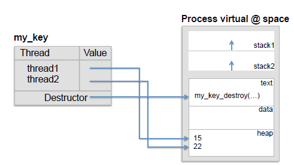

## PThreads API

[TOC]

### Create and manage Threads

````c
int pthread_create (pthread_t * thread, pthread_attr_t * attr, void * (*start_routine)(void *), void * arg );
void pthread_exit (void *retval);
//Suspend the execution of the calling thread until the thread terminates
int pthread_join(pthread_t thread, void **value_ptr );
void pthread_exit ( void *retval );
````

### Thread-specific data



````c
pthread_key_t keyType;
int pthread_key_create(pthread_key_t *key, void (*destructor)(void*));
void *pthread_getspecific(pthread_key_t key);
int pthread_setspecific(pthread_key_t key, void *value);
int pthread_key_delete(pthread_key_t key);
````

### Mutexes and barriers

